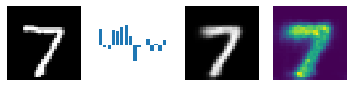
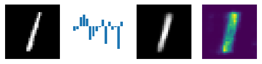
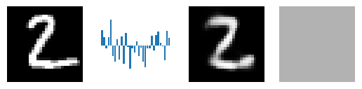
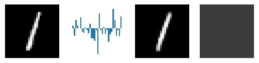
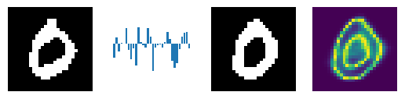
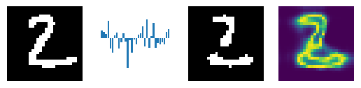
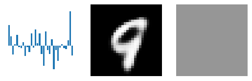
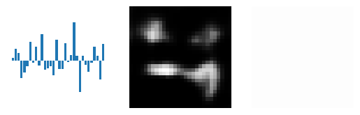
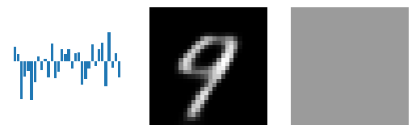
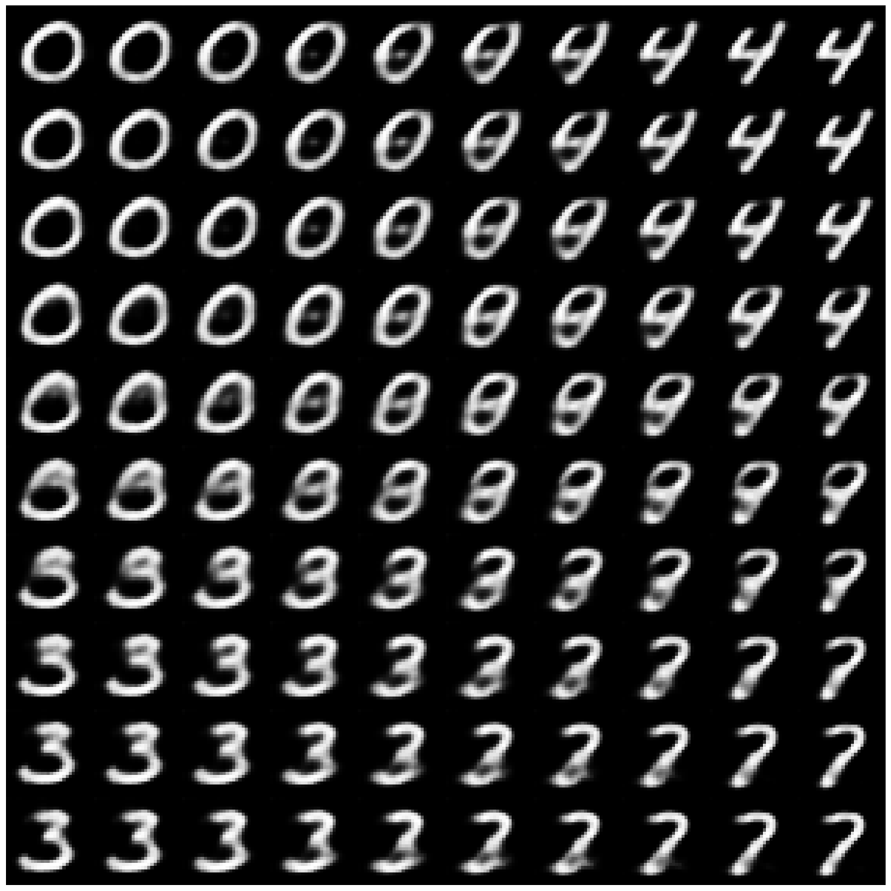

# Variational Autoencoder Implementation for Image Data

This repository contains an implementation of a variational autoencoder (VAE) (Kingma and Welling, "Auto-Encoding Variational Bayes", 2013) in PyTorch that supports three-dimensional data, such as images with any number of colour channels. 

The implementation supports encoders and decoders that use either multilayer perceptrons (MLPs) or convolutional neural networks (CNNs). Mean-field or full covariance Gaussian variational posteriors for the latent variable are supported, as well as Gaussian or Bernoulli likelihoods for the data. The Gaussian likelihood supports homoscedastic, imagewise heteroscedastic, or pixelwise heteroscedastic noise models. The $\beta$-NLL approach (Seitzer et al., "On the Pitfalls of Heteroscedastic Uncertainty Estimation with Probabilistic Neural Networks", 2022) is implemented for use in the pixelwise heteroscedastic noise regime to improve training.

In completing my MEng project within the subfield of amortised variational inference for Bayesian neural networks (BNNs), VAEs lay firmly in my periphery throughout due to the many similarities, and so this project was completed in order to familiarise myself with VAEs in a thorough way.

### Highlights

Although this repository is not intended to be interpreted as an educational article, it is worth showing some figures from the VAE under different settings, for interest's sake. 

  
  

 

The above figures show two examples of the pipeline of data through the VAE under a pixelwise heteroscedastic Gaussian likelihood. On the left is the original image. The encoder learns to produce a posterior distribution over a latent variable that encodes the image; this is done via amortised variational inference. A sample from the variational posterior is depicted through the bar chart, in which each element of the sample is represented by a bar. The latent variable sample is then passed through the decoder which learns to reconstruct the original image from the latent representation. In this instance, the decoder also outputs a variance for every pixel indicating the model's confidence in its reconstruction. For this model, the $\beta$-NLL algorithm was used to avoid premature convergence in training.

  
  

The above figures show two examples of the same pipeline but for the VAE under an imagewise heteroscedastic Gaussian likelihood. The difference is that the decoder outputs a single variance value for a given image. Here we can see that the model is more confident (denoted by a darker shade of grey) with the simpler task of reconstructing a '1' digit. Note also that for these examples a larger latent dimension was used.

  
  

These figures show two examples of the same pipeline but for the model under a Bernoulli likelihood, in which pixel values are assumed to be binary random variables. Using a Bernoulli likelihood for datasets such as MNIST can be very powerful since the confidence estimates come at no extra cost; the univariate Bernoulli distribution only has a single parameter which determines both the mean and the variance, meaning we do not need to increase the size of the decoder in order to get uncertainty estimates. Furthermore, the uncertainty estimates provided by the Bernoulli likelihood are remarkably interpretable (high uncertainty at digit-background boundaries).

  
  
  

Once the VAE is trained, we can use it as a generative model to create new data that comes from the learned dataset distribution $p(\mathcal{D})$. There are a number of ways to do this with a VAE, but one way, that is by no means the recommended way, is to draw latent variable samples from their prior distribution and then use the trained decoder to generate corresponding images. With an imagewise heteroscedastic likelihood, we see that the decoder is confident of its reconstructions that resemble the digit '9' but unconfident of the incoherent reconstruction, as we might expect. The prior distribution over the latent variable is likely to have a much larger support than that of the latent variable posteriors for all the images in the dataset---this would explain why most images generated by sampling from the prior in this way are incoherent; because many samples are *out-of-distribution*.

  

A different way to generate new data is by traversing the latent variable space in the neighbourhood of latent variables known to correspond to meaningful images. We can do this by taking posterior samples from the probabilistic encodings of images and perturbing them by small amounts. In the case of the figure above, we take samples from four images' latent representations (each corner) and linearly interpolate between them to create a grid of generated images. It is interesting to see that sometimes we visit other, intermediate, digits when traversing from one digit to another!
